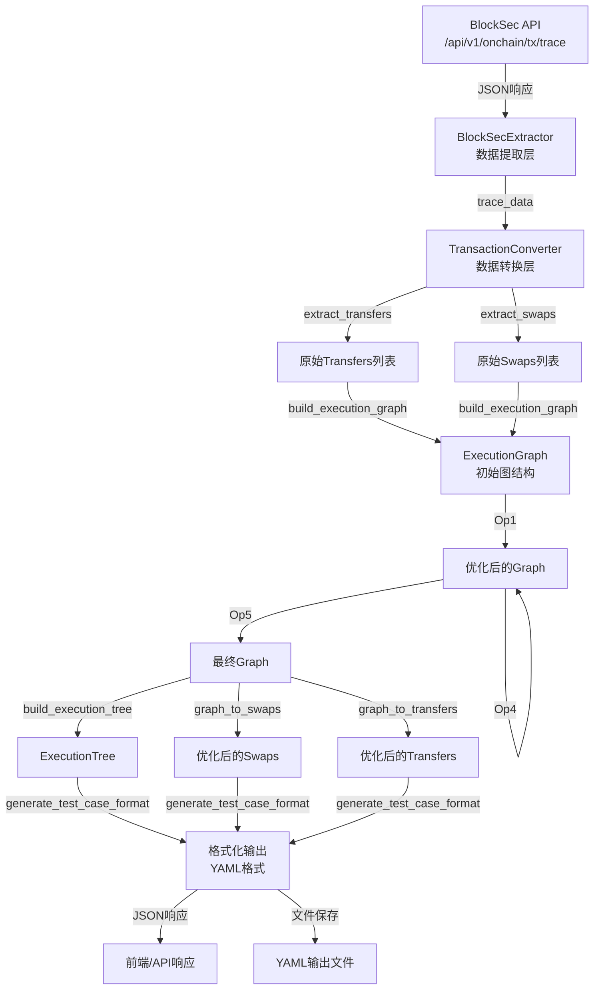
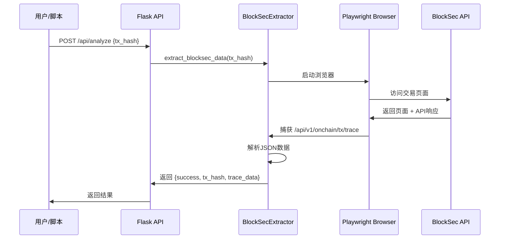
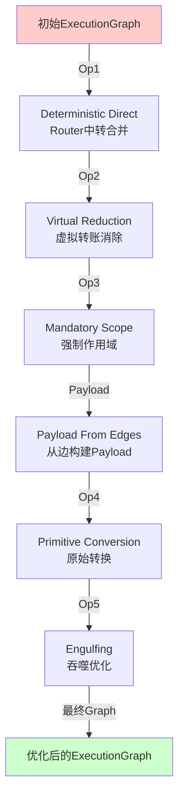
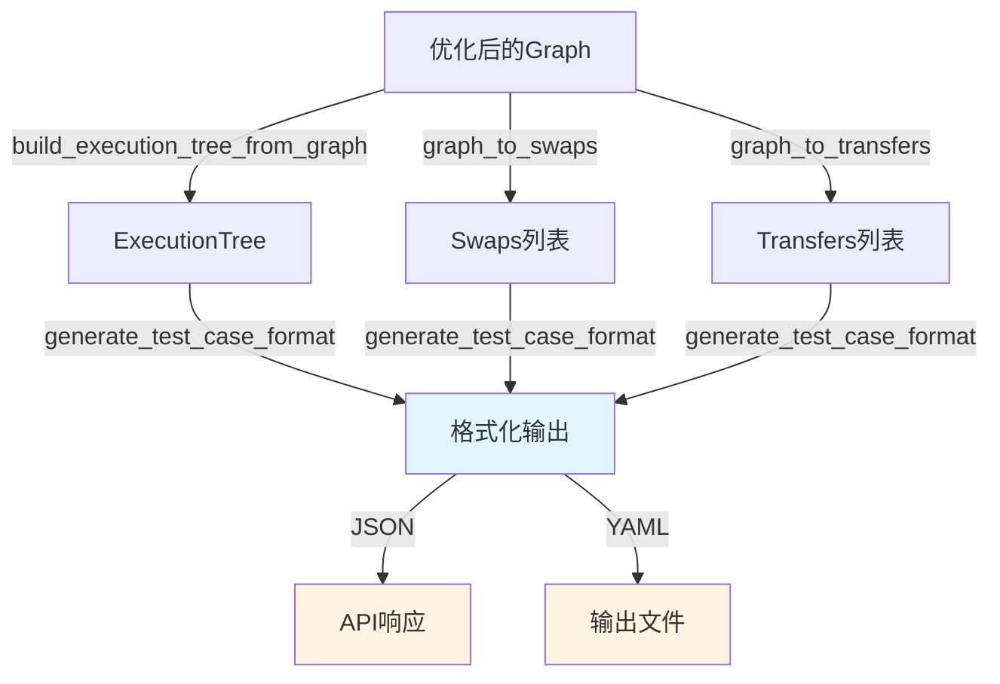
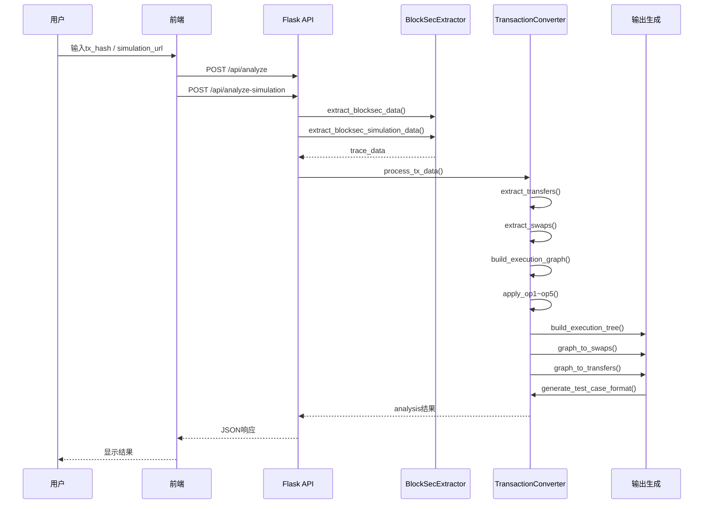

# 数据流转文档 - Data Flow Documentation

本文档详细说明BlockSec交易分析工具中数据在各个模块之间的流转过程。

## 📊 数据流转概览图



## 🔄 详细数据流转图

### 阶段1: 数据提取 (Extraction)



### 阶段2: 数据转换 (Conversion)

```mermaid
graph LR
    A[trace_data] -->|dataMap| B[extract_transfers_from_data]
    A -->|dataMap + mainTrace| C[extract_swaps_from_data]
    B -->|List[Transfer]| D[build_execution_graph]
    C -->|List[Swap]| D
    A -->|mainTrace| D
    D -->|ExecutionGraph| E[初始图结构]
    
    style A fill:#e1f5ff
    style E fill:#fff4e1
```

### 阶段3: 优化处理 (Optimization)



### 阶段4: 输出生成 (Output Generation)



## 1. 数据来源层 (Data Source Layer)

### 1.1 BlockSec API

**位置**: `https://app.blocksec.com/explorer/tx/eth/{tx_hash}/`

**API端点**: `/api/v1/onchain/tx/trace`

**数据格式**:
```json
{
  "dataMap": {
    "节点ID": {
      "invocation": {
        "address": "合约地址",
        "fromAddress": "调用者地址",
        "callData": "调用数据",
        "decodedMethod": {
          "name": "方法名",
          "callParams": [...],
          "returnParams": [...]
        },
        "gasUsed": 12345,
        "operation": "CALL",
        "selector": "0x...",
        "status": true
      }
    }
  },
  "mainTrace": [
    {
      "id": 节点ID,
      "children": [ /* 子节点 */ ],
      "depth": 层级深度,
      "order": 执行顺序,
      "type": 0
    }
  ]
}
```

**关键字段说明**:
- `dataMap`: 包含所有调用节点的详细invocation信息，键为节点ID（字符串）
- `mainTrace`: 调用树结构，定义节点间的层级关系和执行顺序

---

## 2. 数据提取层 (Data Extraction Layer)

### 2.1 BlockSecExtractor 模块

**文件**: `src/calltrace/services/extractor.py`

**类**: `BlockSecExtractor`

**主要方法**:
```python
async def extract_blocksec_data(tx_hash: str) -> Optional[Dict]
```

**工作流程**:
1. 使用Playwright启动无头浏览器
2. 创建浏览器上下文（设置viewport和user-agent）
3. 访问BlockSec交易页面
4. 监听网络请求，捕获 `/api/v1/onchain/tx/trace` API响应
5. 等待15秒确保数据加载完成
6. 解析JSON数据
7. 返回结构化数据

**输出格式**:
```python
{
    'success': True,
    'tx_hash': '0x0807fd45ea0116616ab5cb6b81dd1c395179713fd2465c1d610df14c0c404004',
    'trace_data': {
        'dataMap': {
            '0': {
                'invocation': {...},
                'nodeType': 0
            },
            ...
        },
        'mainTrace': [
            {
                'id': 0,
                'children': [...],
                'depth': 0,
                'order': 0,
                'type': 0
            },
            ...
        ]
    }
}
```

**使用场景**:
- **Web应用**: `src/calltrace/api/routes.py` - `/api/analyze`、`/api/analyze-batch`、`/api/analyze-simulation` 端点
- **批量提取**: `scripts/extract/extract_all_cases.py` - 批量提取多个交易
- **单交易提取**: `scripts/extract/extract_tx_case0.py` - 提取单个交易

---

## 3. 数据转换层 (Data Conversion Layer)

### 3.1 TransactionConverter 模块

**文件**: `src/calltrace/services/converter.py`

**类**: `TransactionConverter`

### 3.2 基础数据提取

#### 3.2.1 提取Transfers

**方法**: `extract_transfers_from_data(data_map: Dict) -> List[Dict]`

**识别规则**:
- Selector为 `0xa9059cbb` (ERC20 transfer标准selector)
- 或方法名包含 `transfer` 且不是event（排除TransferEvent等）

**提取字段**:
- `from`: `invocation.fromAddress` - 转账发起地址
- `to`: 从 `decodedMethod.callParams` 中提取（支持to/recipient/dst/destination等参数名）
- `token`: `invocation.address` - Token合约地址
- `amount`: 从参数中提取（支持amount/value/wad/quantity等参数名）
- `type`: Router/Direct/Virtual（根据地址判断）
  - Router: from或to是Router地址
  - Virtual: from == to 或 from为空
  - Direct: 其他情况
- `gasCost`: `invocation.gasUsed` - Gas消耗
- `node_id`: 节点ID

**输出示例**:
```python
[
    {
        'from': '0x4b2cde9effaa15999010e66da016b2b2c949f747',
        'to': '0x00000000009e50a7ddb7a7b0e2ee6604fd120e49',
        'token': '0xc02aaa39b223fe8d0a0e5c4f27ead9083c756cc2',
        'amount': '261367284155547648',
        'type': 'Router',
        'gasCost': 23000,
        'gasUsed': 23000,
        'node_id': '1'
    },
    ...
]
```

#### 3.2.2 提取Swaps

**方法**: `extract_swaps_from_data(data_map: Dict, main_trace: List) -> List[Dict]`

**识别规则**:
- 方法名包含 `swap`（大小写不敏感）
- 从dataMap中查找所有包含swap的调用

**提取字段**:
- `address`: swap合约地址
- `method`: 方法名（如"swap", "uniswapV3SwapCallback"）
- `node_id`: 节点ID
- `form`: Scope/Node（根据mainTrace中是否有children判断）
- `depth`: 在调用树中的深度
- `gasUsed`: Gas消耗

**输出示例**:
```python
[
    {
        'address': '0x4b2cde9effaa15999010e66da016b2b2c949f747',
        'method': 'swap',
        'node_id': '1',
        'form': 'Scope',
        'depth': 0,
        'gasUsed': 74510
    },
    ...
]
```

### 3.3 构建执行图 (Execution Graph)

**方法**: `build_execution_graph(data_map, main_trace, transfers) -> Dict`

**构建过程**:

1. **收集Swap节点** (`_collect_swap_nodes`):
   - 遍历dataMap，识别所有swap节点
   - 提取invocation和decodedMethod信息

2. **推断节点类型** (`_infer_node_type`):
   - `CallbackV4`: V4 swap签名 `swap((address,address,uint24,int24,address),(bool,int256,uint160),bytes)`
   - `Callback`: 标准swap with callback `swap(address,bool,int256,uint160,bytes)`
   - `Flash`: 方法名包含 `flash`
   - `Standard`: 其他swap方法

3. **推断Token信息**:
   - V4 swap: 从 `key.currency0/currency1` 和 `params.zeroForOne/amountSpecified` 推断
   - 标准swap: 从关联的transfers反推token_in和token_out

4. **构建节点和边**:
   - **Nodes**: 每个swap节点包含完整信息
   - **Edges**: 连接swap节点和Router的transfer边
   - **ExecOrder**: 从mainTrace推导的执行顺序（先序遍历）

**输出结构**:
```python
{
    'nodes': {
        '1': {
            'id': '1',
            'address': '0x4b2cde9effaa15999010e66da016b2b2c949f747',
            'method': 'swap',
            'form': None,  # 将在Op3中设置
            'node_type': 'Standard',
            'payload': [],
            'token_in': '0xc02aaa39b223fe8d0a0e5c4f27ead9083c756cc2',
            'token_out': '0xb2617246e2198f154033a402875bde6ba94b764d',
            'amount_in': None,
            'amount_out': None,
            'execution_plan': None,
            'singleton_id': None
        },
        ...
    },
    'edges': [
        {
            'from': '0x4b2cde9effaa15999010e66da016b2b2c949f747',
            'to': '0x000000000004444c5dc75cb358380d2e3de08a90',
            'token': '0xc02aaa39b223fe8d0a0e5c4f27ead9083c756cc2',
            'amount': 261367284155547648,
            'flow_type': 'Transfer',
            'gasCost': 23000,
            'gasUsed': 23000
        },
        ...
    ],
    'exec_order': ['1', '2', ...]  # 执行顺序
}
```

---

## 4. 优化处理层 (Optimization Layer)

### 4.1 Op1: Deterministic Direct (拓扑直连)

**方法**: `apply_op1_deterministic_direct(graph)`

**目标**: 将Router中转合并为Direct边，简化图结构

**模式识别**:
```
Swap A → Router → Swap B (相同token和amount)
变为:
Swap A → Swap B (Direct)
```

**处理逻辑**:
1. 查找所有 `Swap → Router` 的边
2. 查找匹配的 `Router → Swap` 边（相同token和amount）
3. 创建新的Direct边连接两个Swap
4. 移除原始的两条Router边
5. 更新gasCost为5000（Direct的标准gas）

**效果**: 减少Router节点，简化执行路径

### 4.2 Op2: Virtual Reduction (虚拟转账消除)

**方法**: `apply_op2_virtual_reduction(graph)`

**目标**: 消除虚拟转账（from == to 或 from为空），这些转账实际上没有发生

**处理逻辑**:
1. 识别Virtual类型的transfer（from == to 或 from为空）
2. 从edges中移除这些边
3. 更新相关节点的连接关系

**效果**: 清理无效的转账记录

### 4.3 Op3: Mandatory Scope (强制作用域)

**方法**: `apply_op3_mandatory_scope(graph)`

**目标**: 为有子节点的swap节点设置Scope形式

**处理逻辑**:
1. 检查swap节点在mainTrace中是否有children
2. 如果有children，设置 `form = 'Scope'`
3. 如果没有children，设置 `form = 'Node'`

**效果**: 正确标识swap节点的结构类型

### 4.4 Payload From Edges (从边构建Payload)

**方法**: `apply_payload_from_edges(graph)`

**目标**: 根据边的连接关系构建swap节点的payload子节点

**处理逻辑**:
1. 分析edges的连接关系
2. 识别swap节点之间的调用关系
3. 构建payload子节点列表
4. 更新节点的payload字段

**效果**: 建立swap节点之间的层级关系

### 4.5 Op4: Primitive Conversion (原始转换)

**方法**: `apply_op4_primitive_conversion(graph)`

**目标**: 转换原始类型，优化图结构

**处理逻辑**:
- 处理原始数据类型转换
- 优化节点和边的表示

### 4.6 Op5: Engulfing (吞噬优化)

**方法**: `apply_op5_engulfing(graph)`

**目标**: 合并可以合并的节点，简化执行树

**处理逻辑**:
1. 识别可以合并的节点对
2. 合并节点，更新edges
3. 简化exec_order

**效果**: 进一步简化图结构，减少节点数量

---

## 5. 输出生成层 (Output Generation Layer)

### 5.1 构建执行树

**方法**: `build_execution_tree_from_graph(graph) -> Dict`

**过程**:
1. 从优化后的graph构建树结构
2. 根据exec_order和payload关系设置父子关系
3. 格式化地址显示（使用format_address）
4. 构建root_nodes列表

**输出**:
```python
{
    'nodes': {
        '1': {
            'id': '1',
            'address': '0x4b2cde9e...',  # 格式化后的地址
            'form': 'Scope',
            'parent': None,
            'children': ['2', '3']
        },
        '2': {
            'id': '2',
            'address': '0xb36ec83d...',
            'form': 'Node',
            'parent': '1',
            'children': []
        },
        ...
    },
    'root_nodes': ['1']  # 根节点列表
}
```

### 5.2 转换为Swaps和Transfers

**方法**:
- `graph_to_swaps(graph) -> List[Dict]`
- `graph_to_transfers(graph) -> List[Dict]`

**过程**:
- 从graph的nodes提取swaps，应用优化后的信息
- 从graph的edges提取transfers，应用优化后的类型（Router/Direct/Virtual）
- 保留gasCost和gasUsed信息

### 5.3 格式化输出

**方法**: `generate_test_case_format(tx_hash, swaps, execution_tree, transfers) -> str`

**格式**: test_cases.yaml格式

**包含内容**:
```
========== case0 AFTER Op_5 ==========
TX: 0x0807fd45ea0116616ab5cb6b81dd1c395179713fd2465c1d610df14c0c404004
     📦 Swaps: 1
        [0] 0x4b2Cde9e... | Form: Scope | Method: swap
     
     🌳 ExecutionTree: 1 root nodes
     Root[0]: 0x4b2Cde9e... Form:Scope [1 children]
        Child[0]: 0xb36ec83D... Form:Node
     
     🔗 Transfers: 3 total | Gas Cost: 51000
        Router: 2 | Direct: 1 | Virtual: 0
     
        [0] 🔴 🏊0x4b2Cde9e... → 🏦Router
            Token: 0xC02aaA39... | Amount: 261367284155547648
            Type: Router | Cost: 23000 gas
        ...
```

---

## 6. 完整数据流示例

### 6.1 Web应用流程



### 6.2 脚本处理流程

```
scripts/extract/extract_tx_case0.py
    ↓
使用Playwright提取数据
    ↓
保存为 case0_blocksec_data.json
    ↓
scripts/process/process_case0.py
    ↓
读取JSON文件
    ↓
TransactionConverter处理
    ↓
生成 case0_blocksec_output.yaml
```

---

## 7. 数据存储位置

### 7.1 输入数据
- **来源**: BlockSec API (`/api/v1/onchain/tx/trace`)
- **保存位置**: `local/output/{case}_blocksec_data.json`
- **格式**: JSON
- **结构**:
  ```json
  {
    "tx_hash": "0x...",
    "trace_data": {
      "dataMap": {...},
      "mainTrace": [...]
    }
  }
  ```

### 7.2 输出数据
- **保存位置**: `local/output/{case}_blocksec_output.yaml`
- **格式**: YAML格式，符合test_cases.yaml规范
- **用途**: 对比分析、验证结果

### 7.3 参考数据
- **位置**: `config/test_cases.yaml`
- **用途**: 对比分析、验证结果准确性

---

## 8. 关键数据结构

### 8.1 trace_data (BlockSec API响应)
```python
{
    'dataMap': Dict[str, Dict],  # 节点ID -> 节点数据
    'mainTrace': List[Dict]      # 调用树结构
}
```

### 8.2 ExecutionGraph (中间表示)
```python
{
    'nodes': Dict[str, Dict],    # 节点ID -> 节点信息
    'edges': List[Dict],         # 边列表
    'exec_order': List[str]      # 执行顺序
}
```

### 8.3 最终输出 (Analysis Result)
```python
{
    'swaps': List[Dict],              # Swap列表
    'transfers': List[Dict],          # Transfer列表
    'execution_tree': Dict,           # 执行树结构
    'stats': {
        'swaps_count': int,
        'transfers_count': int,
        'router_count': int,
        'direct_count': int,
        'virtual_count': int,
        'total_gas': int
    },
    'formatted_output': str          # YAML格式字符串
}
```

---

## 9. 模块依赖关系

```
src/calltrace/api/routes.py (API层)
    ├── src/calltrace/services/extractor.py (BlockSecExtractor)
    │   └── playwright (浏览器自动化)
    └── src/calltrace/services/converter.py (TransactionConverter)
        ├── src/calltrace/utils/address.py (工具函数)
        │   ├── format_address()
        │   └── is_router_address()
        └── src/calltrace/config.py (配置)
            ├── ROUTER_ADDRESSES
            ├── TRANSFER_SELECTOR
            └── 其他配置项
```

---

## 10. 数据流转检查点

### 10.1 提取阶段
- ✅ 验证trace_data是否成功获取
- ✅ 验证dataMap和mainTrace是否存在
- ✅ 验证数据格式是否正确

### 10.2 转换阶段
- ✅ 验证transfers和swaps是否成功提取
- ✅ 验证execution_graph结构是否正确
- ✅ 验证节点和边的数量是否合理

### 10.3 优化阶段
- ✅ 验证Op1-Op5是否成功应用
- ✅ 验证graph结构是否优化
- ✅ 验证节点和边的类型是否正确

### 10.4 输出阶段
- ✅ 验证execution_tree结构是否正确
- ✅ 验证最终结果格式是否符合要求
- ✅ 验证统计数据是否准确

---

## 11. 性能考虑

### 11.1 数据量
- **dataMap**: 通常包含几十到几百个节点
- **mainTrace**: 树结构，深度通常为2-5层
- **transfers**: 通常为3-10条
- **swaps**: 通常为1-5个

### 11.2 处理时间
- **数据提取**: 15-30秒（等待API响应）
- **数据转换**: <1秒
- **优化处理**: <1秒
- **输出生成**: <1秒

### 11.3 内存使用
- **trace_data**: 通常为几MB到几十MB
- **ExecutionGraph**: 通常为几百KB
- **最终输出**: 通常为几KB到几十KB

---

## 附录：相关文件

### 核心模块
- **提取模块**: `src/calltrace/services/extractor.py`
- **转换模块**: `src/calltrace/services/converter.py`
- **API路由**: `src/calltrace/api/routes.py`
- **工具函数**: `src/calltrace/utils/address.py`
- **配置**: `src/calltrace/config.py`

### 脚本文件
- **提取脚本**: `scripts/extract/`
  - `extract_tx_case0.py` - 提取单个交易
  - `extract_all_cases.py` - 批量提取
- **处理脚本**: `scripts/process/`
  - `process_case0.py` - 处理单个case
  - `process_all_cases.py` - 批量处理

### 文档
- **IR映射说明**: `docs/development/IR_MAPPING.md`
- **开发文档**: `docs/development/README.md`
- **Web使用说明**: `docs/development/README_WEB.md`

---

## 更新日志

- 2024-12-23: 创建数据流转文档，包含完整的数据流图和详细说明

