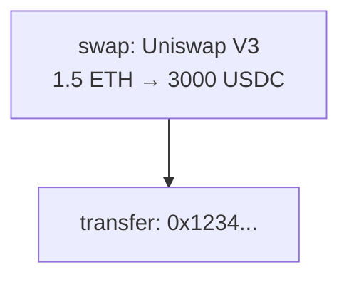

# Pool 过滤业务文档

## 📋 概述

CallTraceSniffer 是一个以太坊交易分析工具，核心功能是从 BlockSec 平台提取交易数据，并转换为标准化的 IR (Intermediate Representation) 格式。

## 🎯 核心业务流程

### 1. 数据处理管道

```
┌─────────────────────────────────────────────────────────────────────────┐
│                         数据处理管道                                      │
├─────────────────────────────────────────────────────────────────────────┤
│                                                                         │
│  ┌──────────────┐    ┌──────────────┐    ┌──────────────┐              │
│  │  数据源      │    │  数据提取    │    │  数据转换    │              │
│  │              │───▶│              │───▶│              │              │
│  │ BlockSec页面 │    │ Extractor    │    │ IR Builder   │              │
│  │ BlockSec API │    │              │    │              │              │
│  └──────────────┘    └──────────────┘    └──────────────┘              │
│         │                   │                   │                       │
│         ▼                   ▼                   ▼                       │
│  ┌──────────────┐    ┌──────────────┐    ┌──────────────┐              │
│  │ trace_data   │    │ dataMap      │    │ IR V1 JSON   │              │
│  │ gasFlame     │    │ mainTrace    │    │ Mermaid DAG  │              │
│  │ fundflow     │    │ 其他数据     │    │ 统计信息     │              │
│  └──────────────┘    └──────────────┘    └──────────────┘              │
│                                                                         │
└─────────────────────────────────────────────────────────────────────────┘
```

### 2. 主要业务场景

| 场景 | 输入 | 处理流程 | 输出 |
|------|------|----------|------|
| 单个交易分析 | tx_hash | 提取→解析→转换 | IR V1 + Mermaid |
| 模拟交易分析 | simulation_url | 提取→解析→转换 | IR V1 + Mermaid |
| 模拟并分析 | simulation_params | 模拟→提取→转换 | IR V1 + 统计 |
| 批量分析 | CSV文件 | 循环(提取→转换) | 批量结果 |

## 🧩 交易池过滤（Uniswap Pool Filter）

### 业务需求

- 前端新增 Tab：批量输入 tx_hash（换行），判断是否“包含 Uniswap 池”
- 不直接从前端访问 Dune，避免消耗 credit
- 后端集中调用 Dune，结果直接返回 true/false

### 当前实现（维护性 + 成本优先）

- **数据来源**：Dune `dex.trades`（Uniswap）
- **查询方式**：按 tx_hash 列表批量查询，不做本地池缓存
- **判断条件**：`project = 'uniswap'` 且 `block_date > CURRENT_DATE - INTERVAL '3' DAY`
- **结果**：`tx_hash -> bool_used_uni`

### 实现要点

1. **Dune SQL**
   - 使用 `VALUES {{tx_hashes}}` 参数传入多笔交易
   - 返回 `tx_hash` 与 `bool_used_uni`
2. **后端调用**
   - `DuneService.fetch_uniswap_flags()` 负责参数拼接与结果解析
   - `PoolFilterService._check_tx_hashes_with_dune()` 对外返回结果
3. **前端输入**
   - 最多 10 条 tx_hash
   - 去重后提交
   - 展示重复输入提示与命中结果

### 环境配置

在项目根目录 `.env` 中配置：

```
DUNE_API_KEY=your_api_key
```

后端启动时自动加载 `.env`，否则 `/api/unipool/check` 会返回错误。

### 对外接口

- `POST /api/unipool/check`
  - 输入：`{ "tx_hashes": ["0x..", ...] }`
  - 输出：`{ "results": [{ "tx_hash": "...", "has_uni_pool": true }] }`
- `GET /api/unipool/status`
  - 当前返回 storage disabled（未启用本地池缓存）

### 接口时序图（前端 → 后端）

```text
User
  |
  v
Frontend (Pool Tab)
  |
  | POST /api/unipool/check
  | body: { tx_hashes: [...] }
  v
Flask API
  |
  | 1) 去重/校验
  | 2) Dune 批量查询 dex.trades
  | 3) 组装 tx_hash -> bool_used_uni
  v
Response
  |
  v
Frontend Render
```

## 🔧 核心服务模块

### 1. BlockSecExtractor（数据提取服务）

**位置**: `src/calltrace/services/extractor.py`

**职责**: 从 BlockSec 平台提取交易追踪数据

```python
class BlockSecExtractor:
    """BlockSec数据提取器"""
    
    async def extract_blocksec_data(tx_hash: str) -> dict:
        """提取链上交易数据"""
        # 1. 构造 BlockSec URL
        # 2. 使用 Playwright 加载页面
        # 3. 拦截 API 响应，提取 trace_data
        # 4. 返回结构化数据
    
    async def extract_blocksec_simulation_data(sim_url: str) -> dict:
        """提取模拟交易数据"""
        # 1. 解析模拟 URL
        # 2. 提取 trace_data
        # 3. 返回结构化数据
```

**提取的数据类型**:

| 端点 | 数据键 | 描述 |
|------|--------|------|
| fundflow | `fundflow` | 资金流向 |
| balance-change | `balance_change` | 余额变化 |
| token-info | `token_info` | 代币信息 |
| address-label | `address_label` | 地址标签 |
| basic-info | `basic_info` | 基本信息 |
| gas-flame | `gas_flame` | Gas火焰图 |
| trace | `trace_data` | 完整追踪数据 |

### 2. AnalysisService（分析服务）

**位置**: `src/calltrace/services/analysis_service.py`

**职责**: 协调数据提取和转换，提供统一的分析接口

```python
class AnalysisService:
    """分析服务（核心协调器）"""
    
    def __init__(
        self,
        cache: dict,                    # 结果缓存
        extractor_factory: Callable,    # 提取器工厂
        mermaid_builder: Callable,      # Mermaid构建器
        router_config: RouterConfig,    # 路由器配置
        fixture_loader: FixtureLoader,  # 测试数据加载器
    ):
        pass
    
    def analyze_tx(tx_hash: str) -> ServiceResult:
        """分析单个交易"""
        # 1. 检查是否使用fixture（测试模式）
        # 2. 调用extractor提取数据
        # 3. 调用_build_analysis_from_result处理
    
    def analyze_simulation(sim_url: str) -> ServiceResult:
        """分析模拟交易"""
        # 1. 解析模拟URL获取tx_hash
        # 2. 提取模拟数据
        # 3. 处理并返回结果
```

**ServiceResult 结构**:
```python
@dataclass
class ServiceResult:
    payload: Optional[dict]  # 成功时的数据
    error: Optional[str]     # 错误信息
    status_code: int         # HTTP状态码
    
    @property
    def ok(self) -> bool:
        return self.error is None
```

### 3. IR Builder（IR构建服务）

**位置**: `src/calltrace/services/ir_v1_blocksec.py`

**职责**: 将 BlockSec trace_data 转换为 IR V1 格式

```python
def build_blocksec_ir(trace_data: dict, tx_hash: str, extra: dict) -> dict:
    """构建 IR V1 结构"""
    # 1. 解析 mainTrace 构建调用树
    # 2. 识别 swap/transfer 节点
    # 3. 提取代币金额
    # 4. 生成标准化 IR
```

**IR V1 核心结构**:
```json
{
  "tx_hash": "0x...",
  "pattern": "swap|transfer|unknown",
  "baseTokenAmountIn": 1000000,
  "baseTokenAmountOut": 999000,
  "rootTrace": {
    "type": "swap",
    "swap": {
      "poolId": "0x...",
      "poolLabel": "Uniswap V3",
      "tokenIn": "0x...",
      "tokenOut": "0x...",
      "amountIn": 1.5,
      "amountOut": 3000.0
    },
    "transfer": null,
    "callback": [...]
  }
}
```

### 4. 工具函数（Analysis Utils）

**位置**: `src/calltrace/utils/analysis_utils.py`

**职责**: 提供纯函数形式的分析工具

| 函数 | 输入 | 输出 | 描述 |
|------|------|------|------|
| `count_ir_nodes()` | IR节点 | (swaps, transfers) | 统计节点数量 |
| `extract_total_gas()` | trace_data | int | 提取总Gas |
| `extract_transfer_edges()` | trace_data | list[edge] | 提取转账边 |
| `compute_flow_counts()` | trace_data, routers | 统计元组 | 计算流量统计 |
| `process_tx_data()` | trace_data, config | analysis | 完整数据处理 |

## 📊 数据转换规则

### 1. Swap 节点识别

**识别规则**:
```python
# V3 Swap 事件
TOPIC_V3 = "0xc42079f94a6350d7e6235f29174924f928cc2ac818eb64fed8004e115fbcca67"

# V4 Swap 事件
TOPIC_V4 = "0x40e9cecb9f5f1f1c5b9c97dec2917b7ee92e57ba5563708daca94dd84ad7112f"

# V2 Swap 事件
TOPIC_V2 = "0xd78ad95fa46c994b6551d0da85fc275fe613ce37657fb8d5e3d130840159d822"
```

**处理流程**:
1. 遍历 mainTrace 查找事件日志
2. 匹配 topic 识别 swap 类型
3. 解析参数提取 tokenIn/tokenOut
4. 计算金额（考虑精度）

### 2. Transfer 节点识别

**识别规则**:
```python
# ERC20 Transfer 事件
TOPIC_TRANSFER = "0xddf252ad1be2c89b69c2b068fc378daa952ba7f163c4a11628f55a4df523b3ef"
```

**处理流程**:
1. 查找 transfer 方法调用
2. 提取 from/to/amount
3. 判断流向（Router/Direct/Virtual）

### 3. 流量分类

| 类型 | 条件 | 描述 |
|------|------|------|
| Transfer | from或to是Router | 通过Router的转账 |
| Direct | from和to都不是Router | 直接转账 |
| Virtual | from == to | 虚拟转账（自转） |

**Router 识别**:
```python
ROUTER_ADDRESSES = [
    "0x3fc91a3afd70395cd496c647d5a6cc9d4b2b7fad",  # Uniswap Universal Router
    "0x000000000022d473030f116ddee9f6b43ac78ba3",  # Permit2
    "0x68b3465833fb72a70ecdf485e0e4c7bd8665fc45",  # SwapRouter02
    # ...
]
```

## 🔄 模拟交易流程

### BlockSec Simulation API

**位置**: `src/calltrace/services/blocksec_simulation.py`

**流程**:
```
1. 构建请求参数
   └─ build_simulation_request_payload(raw_params)
      ├─ 标准化参数名称
      ├─ 转换 ETH -> Wei
      └─ 验证必填字段

2. 发送模拟请求
   └─ run_simulation_with_payload(payload)
      ├─ 加载 BlockSec cookies
      ├─ POST /api/v1/tx/simulation
      └─ 解析响应

3. 获取追踪数据
   ├─ 方式A: 从响应直接获取 trace_data
   └─ 方式B: 使用 Playwright 抓取页面

4. 转换为 IR
   └─ process_tx_data(trace_data)
```

**SimulationResult 结构**:
```python
@dataclass
class SimulationResult:
    simulation_id: Optional[str]
    tx_hash: str
    simulation_url: str
    timestamp_ms: int
    trace_data: Optional[dict]
    balance_change: Optional[dict]
    basic_info: Optional[dict]
```

## 📈 统计信息计算

### Stats 结构

```python
{
    "swaps_count": 3,        # swap 节点数量
    "transfers_count": 5,    # 总转账数量
    "router_count": 2,       # Router转账数量
    "direct_count": 2,       # 直接转账数量
    "virtual_count": 1,      # 虚拟转账数量
    "total_gas": 150000      # 总Gas消耗
}
```

### 计算逻辑

```python
def compute_flow_counts(trace_data, router_addresses):
    """计算流量统计"""
    edges = extract_transfer_edges(trace_data)
    
    # 分类转账
    for edge in edges:
        if edge["from"] == edge["to"]:
            edge["flow"] = "Virtual"
        elif edge["from"] in routers or edge["to"] in routers:
            edge["flow"] = "Transfer"
        else:
            edge["flow"] = "Direct"
    
    # 合并配对转账
    # (Router收入 + Router支出) -> Direct
    
    return (total, router_count, direct_count, virtual_count)
```

## 🎨 Mermaid DAG 生成

**位置**: `src/calltrace/services/mermaid_dag.py`

**输入**: IR V1 JSON
**输出**: Mermaid 图表代码

```python
def build_mermaid_dag(ir_payload: dict) -> str:
    """生成 Mermaid DAG 代码"""
    # 1. 遍历 rootTrace 树
    # 2. 为每个节点生成 Mermaid 节点
    # 3. 生成边连接
    # 4. 添加样式类
```

**示例输出**:


## 🔒 缓存机制

### 缓存结构

```python
extracted_data_cache = {
    "0xabc...": {
        "trace_data": {...},
        "analysis": {
            "ir_v1": {...},
            "ir_v1_json": "...",
            "stats": {...}
        }
    }
}
```

### 缓存策略

- **写入时机**: 分析成功后立即写入
- **读取时机**: 下载结果、获取IR时优先读取
- **生命周期**: 内存缓存，应用重启后清空

## 📋 错误处理

### 错误类型

| 错误 | 原因 | 处理 |
|------|------|------|
| 无效的交易哈希 | 格式不正确 | 返回 400 |
| 无法提取数据 | 网络/页面错误 | 返回 500 |
| 未找到trace数据 | 页面无数据 | 返回 500 |
| 数据处理失败 | IR转换错误 | 返回 500 |
| Cookie失效 | BlockSec认证过期 | 返回 403 |

### ServiceResult 错误传递

```python
# 成功
ServiceResult(payload={...}, error=None, status_code=200)

# 失败
ServiceResult(payload=None, error="错误信息", status_code=500)
```

## 🧪 测试模式

### Fixture 加载

通过环境变量启用测试模式：

```bash
USE_FIXTURE=1 python run.py
```

**工作原理**:
```python
class FixtureLoader:
    def should_use_fixture(self) -> bool:
        return os.getenv("USE_FIXTURE") in {"1", "true"}
    
    def load_fixture(self) -> dict:
        return json.load(open("tests/fixtures/xxx.json"))
```

这样可以在不访问 BlockSec 的情况下测试业务逻辑。
